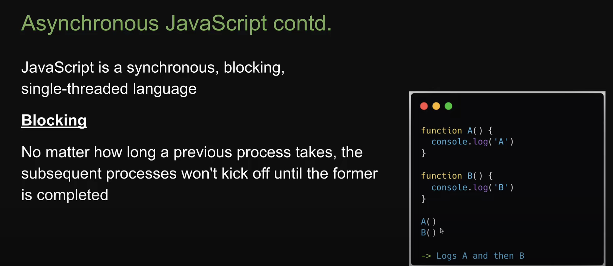

inside a class we can directly write a function without writing function in front of it

## STREAMS AND BUFFERS

- A stream is a sequence of data that is being moved from one point to another over time
  Ex:- A stream of data over the internet being moved from one computer to another
  Ex:- A stream of data being transferred from one file to another within the same computer
- In Node.js Idea is to process streams of data in chunks as they arrive instead of waiting for the entire data to be available before processing.

Ex: Watching a video on Youtube, we dont wait entire video to be downloaded to watch, the data arrives in chunks and you watch in chunks while the rest of the data arrives over time

## ASYNCHRONOUS CODE

