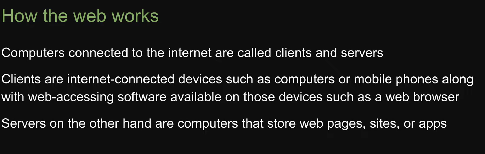
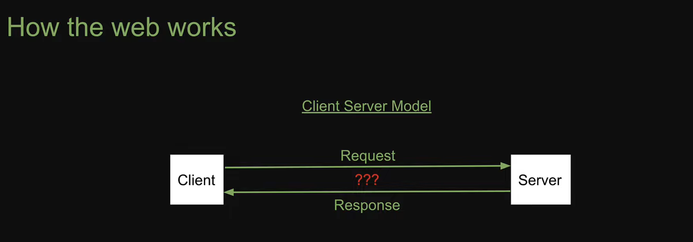
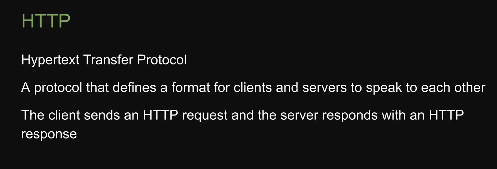
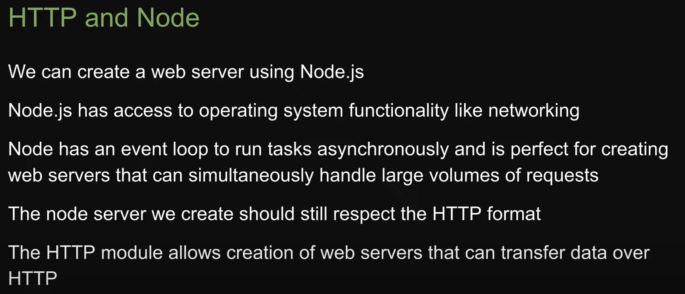
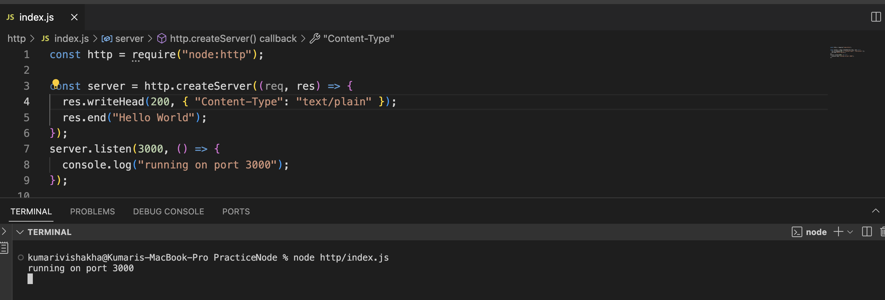
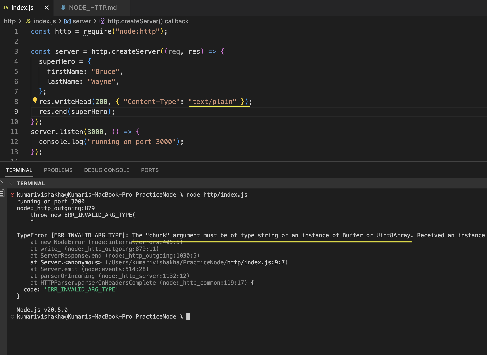
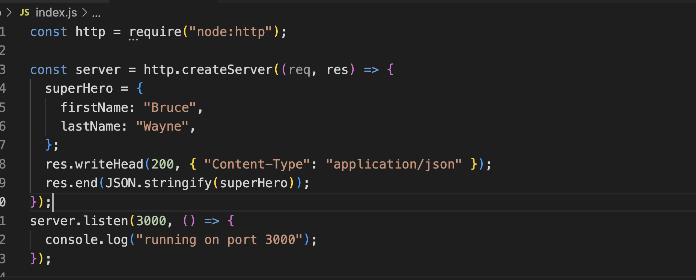
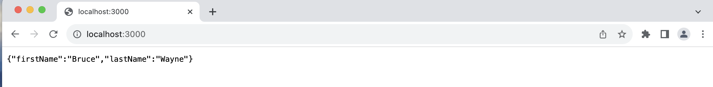
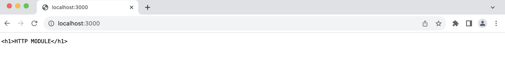
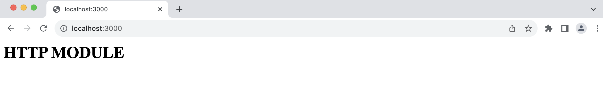

- There is data transfer between the client and the server, but in formatt is that data. What if the request sent by the client is not understood by the server or what if the response sent by the server is not understood by the client




- `const http = require("node:http");`
- we invoke createServer() method on http module. This method accepts a call back function as an argument, this function receives two arguments req and response.

- It turns out http module also extends the `EventEmitter` class. The call back function specified in createServer() method is actually a listener, that is whenever a request reaches the server this method is executed.The request argument contains information about the incoming request and the second argument is the server response and we use it to build the response that has to sent back to the client

- Node will handle the incoming request and we will write the code to send back the response

- Also we need to inform the server to listen to incoming requests using port number
  

- port number is like door number in an apartment. On a machine there can be many other servers, but our node js server runs on port 3000.
- optionally we can also specify a callback function when a server starts to listen

- When we run the program doesn't exits its waiting for requests on port 3000

## Response Methods

- `res.writeHead`
- `res.writeHead(404, { "Content-Type": "application/json" })`;
- method is to set response headers which takes arguments like , status code, content-Type

- `res.end`
  The res.end() function is used to end the response process.

## Response with json data

lets say we create a superhero object with first and last name , when we try to send this we get the error


- We cannot send the object directly, we need to parse it using `JSON.stringify(superHero)`

- `JSON.stringify(superHero)` converts a JavaScript value to a JSON string,
- also set `"Content-Type":"application/json"`
  
  

## Response with HTML data

for html response we pass html in `end(<h1>HTTP</h1>)` and change the `"Content-Type":"text/html"`

```javascript
const http = require("node:http");

const server = http.createServer((req, res) => {
  res.writeHead(200, { "Content-Type": "text/plain" });
  res.end("<h1>HTTP MODULE</h1>");
});
server.listen(3000, () => {
  console.log("running on port 3000");
});
```



```javascript
const http = require("node:http");

const server = http.createServer((req, res) => {
  res.writeHead(200, { "Content-Type": "text/html" });
  res.end("<h1>HTTP MODULE</h1>");
});
server.listen(3000, () => {
  console.log("running on port 3000");
});
```



## Http Routing

```javascript
const http = require("node:http");

const server = http.createServer((req, res) => {
  if (req.url == "/") {
    res.writeHead(200, { "Content-Type": "text/plain" });
    res.end("Home Page");
  } else if (req.url == "/html") {
    res.writeHead(200, { "Content-Type": "text/html" });
    res.end("<h1>html</h1>");
  } else if (req.url == "/api") {
    res.writeHead(200, { "Content-Type": "text/html" });
    res.end("<h1>api</h1>");
  } else {
    res.writeHead(400, { "Content-Type": "text/html" });
    res.end("<h1>bad request</h1>");
  }
});
server.listen(3000, () => {
  console.log("running on port 3000");
});
```
