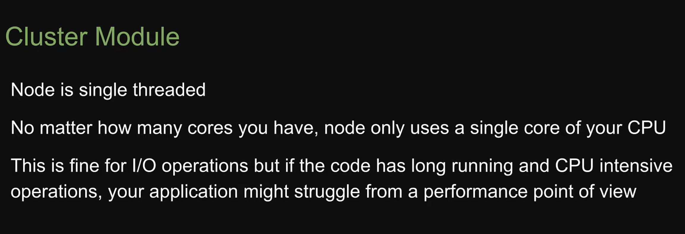
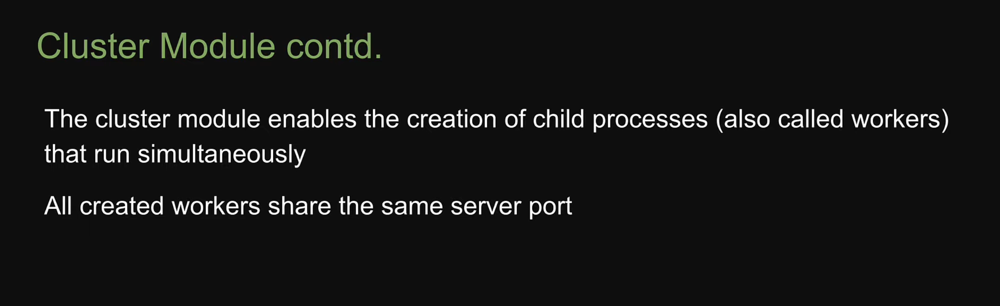
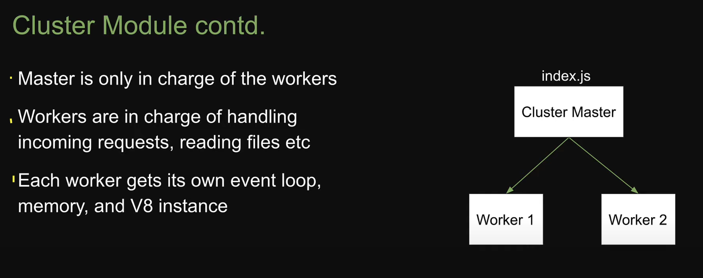
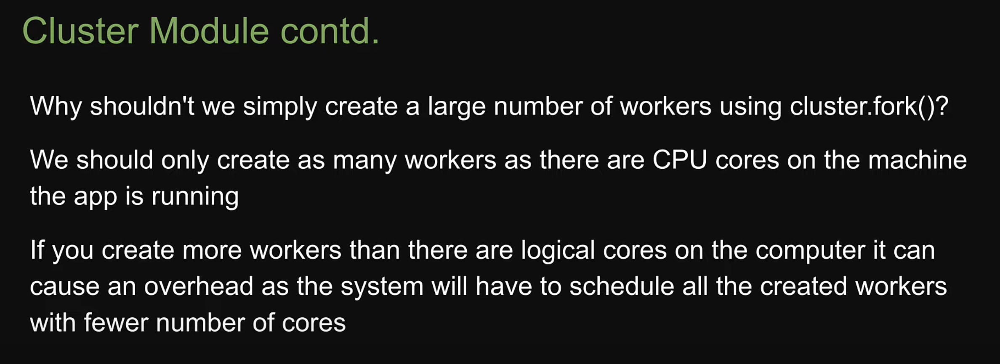
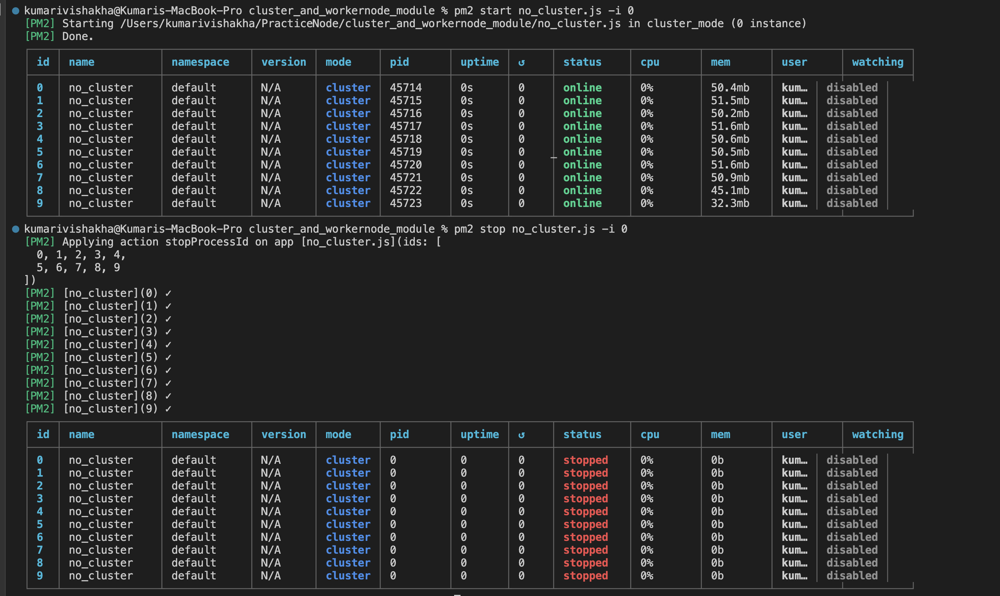
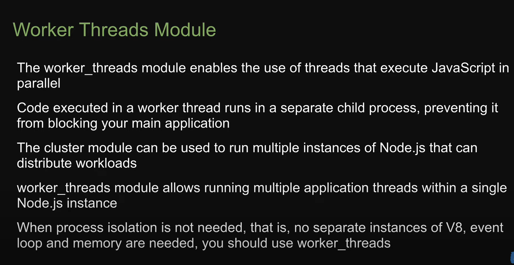

# NO CLUSTER MODULE




```javascript
const http = require("node:http");

const server = http.createServer((req, res) => {
  if (req.url === "/") {
    res.writeHead("200", { "Content-Type": "text/plain" });
    res.end("Home Page");
  } else if (req.url === "/slowpage") {
    for (let i = 0; i < 6000000000; i++) {}
    res.writeHead("200", { "Content-Type": "text/plain" });
    res.end("Slow Page");
  }
});

server.listen(3000, () => {
  console.log("listening on port 3000");
});
```

- hit http://localhost:3000/ then hit http://localhost:3000/slowpage the `Home Page` will be loaded in some `miliseconds` and `SlowPage` in few `seconds`
- hit http://localhost:3000/slowpage then hit http://localhost:3000/ the `Slow Page` will be loaded in some `seconds` and `Home Page` also in `seconds` , Slow Page slows the loading on Home Page also . We can check using networks tab in browser

# CLUSTER MODULE



- index.js is treated as cluster master and this master is incharge of spawning new workers which runs as instance of our node application

- Master is incharge of workers starting, stopping, retstarting etc but doesnot execute application code itself
- Master is not incharge of handling incoming requests, reading files etc. These are worker instances job
- requests are shared among worker nodes without blocking any requests

cluster.js

```javascript
const cluster = require("node:cluster");

if (cluster.isMaster) {
  console.log(`Master Process ${process.pid} is running`);
} else {
  console.log(`Worker Process ${process.pid} is running`);
}
```

output

```
Master Process 44361 is running
```

- `isMaster` to check the master node . if you run `node cluster.js` in the terminal node treats this file as master and and sets isMaster to true

## What to do as master and as worker?

- As master we need to create new workers
- to create worker we use fork method on master object

```javascript
const cluster = require("node:cluster");
const http = require("node:http");

if (cluster.isMaster) {
  console.log(`Master Process ${process.pid} is running`);
  // create two workers by calling it twice
  cluster.fork();
  cluster.fork();
} else {
  //worker handles request
  console.log(`Worker Process ${process.pid} is running`);
  const server = http.createServer((req, res) => {
    if (req.url === "/") {
      res.writeHead("200", { "Content-Type": "text/plain" });
      res.end("Home Page");
    } else if (req.url === "/slowpage") {
      for (let i = 0; i < 6000000000; i++) {}
      res.writeHead("200", { "Content-Type": "text/plain" });
      res.end("Slow Page");
    }
  });

  server.listen(3000, () => {
    console.log("listening on port 3000");
  });
}
```

- - hit http://localhost:3000/slowpage then hit http://localhost:3000/ the `Slow Page` will be loaded in some `seconds` and `Home Page` also in `miliseconds` , Slow Page loading doesn't block Home Page loading

  - First worker with its own node instance handles the first request, second worker with its own node instance handles the second request

- Create two worker threads at minimum. if we create one it is same as no cluster scenario
  

- How many workers we can create
  ```javascript
  const os = require("node:os");
  console.log(os.cpus().length);
  ```
- npm package `pm2` can create worker node for us depending on our system `npm install -g pm2`
- install npm2 and run `no_cluster.js` file is cluster mode
- Command : `pm2 start no_cluster.js -i 0` // 0 indicates we want pm2 to figure out optimum number of workers to create , if we specify 2 pm2 will create only two workers

- To stop workers : pm2 stop no_cluster.js -i 0
  

# Worker Threads Module



main_thread.js

```javascript
const http = require("node:http");
const { Worker } = require("node:worker_threads");

const server = http.createServer((req, res) => {
  if (req.url === "/") {
    res.writeHead("200", { "Content-Type": "text/plain" });
    res.end("Home Page");
  } else if (req.url === "/slowpage") {
    //create worker instance to this we pass the path of a worker file as argument
    const worker = new Worker("./worker_thread.js");
    worker.on("message", (j) => {
      res.writeHead("200", { "Content-Type": "text/plain" });
      res.end("Slow Page " + j);
    });
  }
});

server.listen(3000, () => {
  console.log("listening on port 3000");
});
```

worker_thread.js

```javascript
const { parentPort } = require("node:worker_threads");
let j = 0;
for (let i = 0; i < 6000000000; i++) {
  j++;
}
parentPort.postMessage(j);
```
